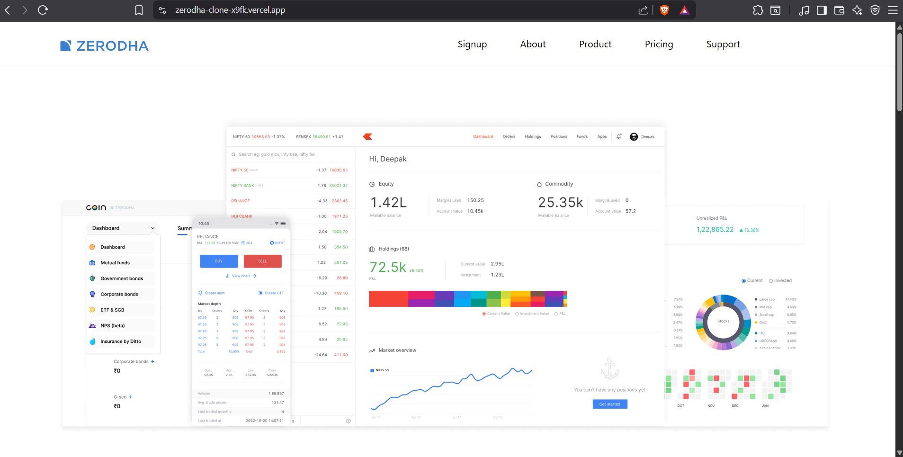
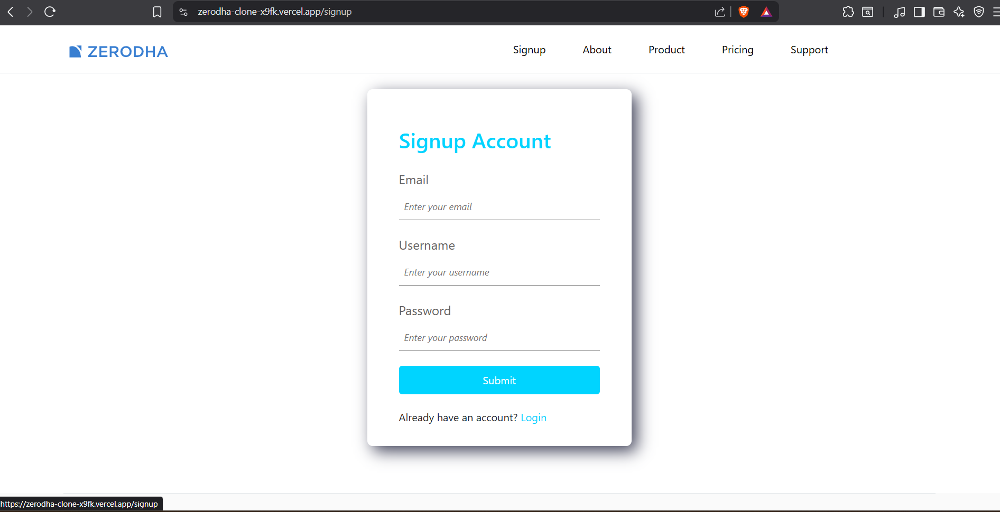
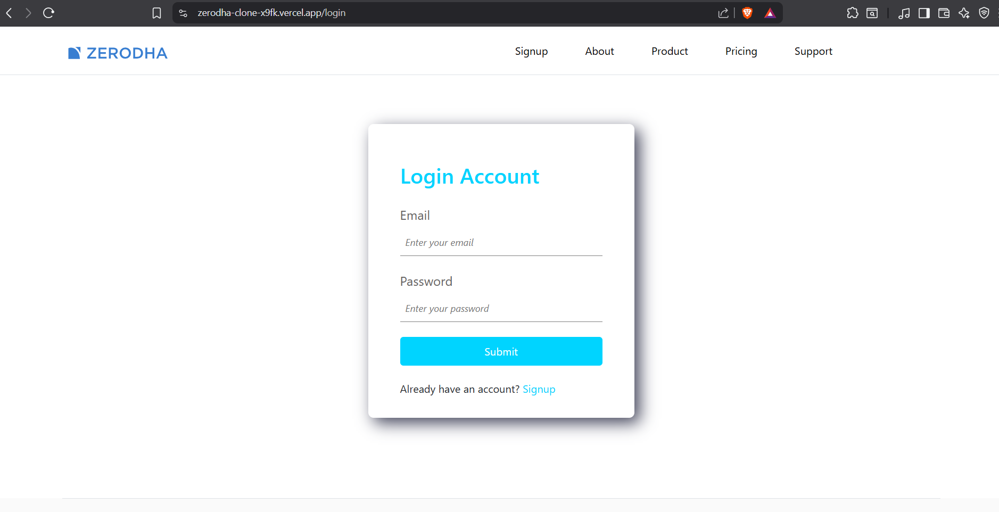
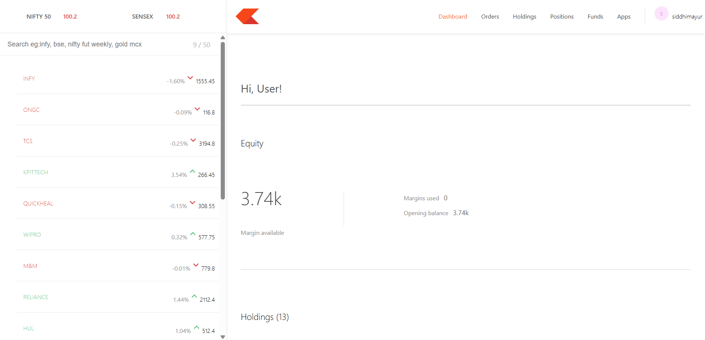
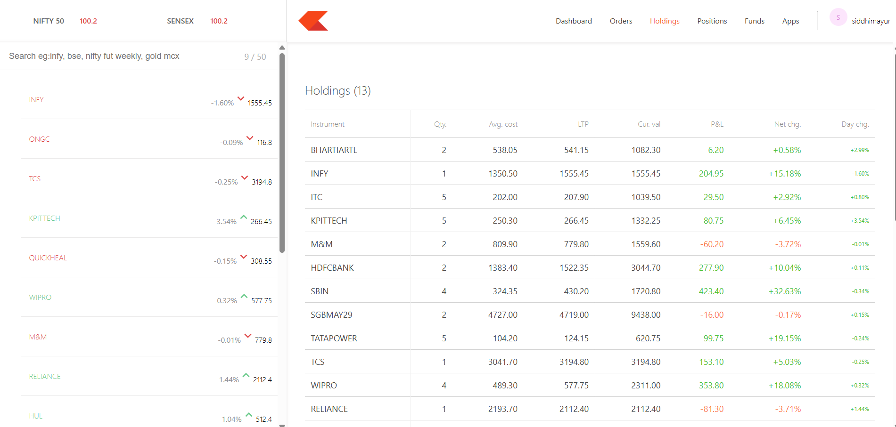
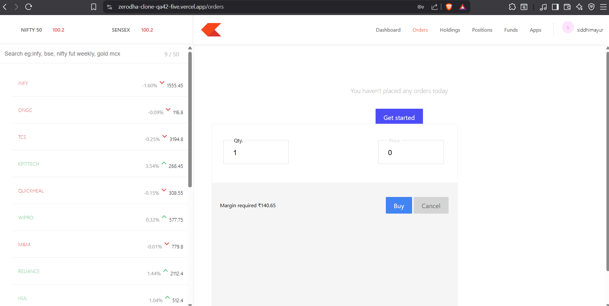
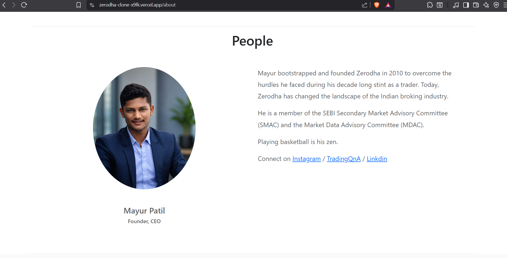

# 📈 Zerodha Clone

A full-stack **Zerodha Clone** inspired by the Zerodha trading platform. This project includes a landing website, secure user authentication, and a trading dashboard where users can view holdings, positions, orders, and funds.

---

## 🚀 Live Demo

### 🌐 Landing Website
https://zerodha-clone-x9fk.vercel.app

### 📊 Dashboard
https://zerodha-clone-qa42-five.vercel.app

### 🔗 Backend API
https://zerodha-clone-2-p3wc.onrender.com

---

# 📸 Project Screenshots

## 🏠 Landing Page



---

## 🔐 Signup



---

## 🔑 Login



---

## 📊 Dashboard



---

## 💼 Holdings



---

## 📝 Orders



---
## 📝 Team



---

# ✨ Features

- User Signup
- User Login
- JWT Authentication
- Protected Dashboard
- Holdings
- Positions
- Orders
- Funds
- Responsive Design
- Logout
- MongoDB Database
- REST API
- MERN Stack

---

# 🛠 Tech Stack

## Frontend

- React.js
- React Router DOM
- Bootstrap
- Axios
- React Toastify

## Dashboard

- React.js
- Chart.js
- Material UI
- Axios

## Backend

- Node.js
- Express.js
- MongoDB
- Mongoose
- JWT
- bcryptjs
- Cookie Parser

## Deployment

- Vercel
- Render

---

# 📂 Folder Structure

```
Zerodha-Clone
│
├── frontend
│
├── dashboard
│
├── bakend
│
└── screenshots
```

---

# 🔐 Authentication Flow

```
Signup
      │
      ▼
MongoDB
      │
      ▼
Login
      │
      ▼
JWT Token Generated
      │
      ▼
Stored in Local Storage
      │
      ▼
Protected Dashboard
```

---

# ⚙️ Installation

Clone the repository

```bash
git clone https://github.com/patilmayurviks/Zerodha-Clone.git
```

---

## Frontend

```bash
cd frontend
npm install
npm start
```

---

## Dashboard

```bash
cd dashboard
npm install
npm start
```

---

## Backend

```bash
cd bakend
npm install
npm start
```

---

# 🌍 Environment Variables

Create a `.env` file inside the backend folder.

```env
PORT=3002

MONGO_URL=your_mongodb_connection_string

TOKEN_KEY=your_secret_key
```

---

# 👨‍💻 Author

## Mayur Patil

Computer Engineering Student

Dr. D. Y. Patil Institute of Technology, Pune

### GitHub

https://github.com/patilmayurviks

### LinkedIn

https://www.linkedin.com/in/mayur-patil-37436b326/

---

# ⭐ Support

If you like this project, don't forget to ⭐ star the repository.
